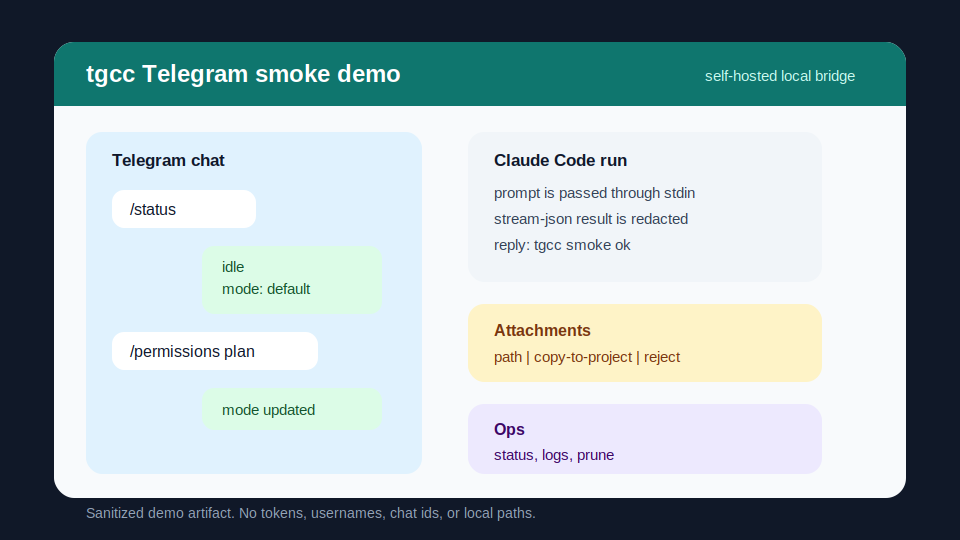

# tgcc - 用 Telegram 控制 Claude Code

[](https://github.com/Ike-li/claude-code-tg/actions/workflows/ci.yml)
[](docs/compatibility.md)
[](LICENSE)
[](docs/compatibility.md)

[English](README.en.md) | 中文

**用手机给 Claude Code 发消息，让它在你的电脑上写代码。**

在 Telegram 发送指令 → tgcc 在本地调用 Claude Code CLI → 结果发回 Telegram



---

## ⚡ 3 步开始

```bash
# 1. 安装
uv tool install "git+https://github.com/Ike-li/claude-code-tg.git"

# 2. 配置（会引导你填写 Telegram Bot Token 和用户 ID）
tgcc init

# 3. 启动
tgcc start
```

然后在 Telegram 给你的 Bot 发消息就行了！

<details>
<summary>📋 需要准备什么？</summary>

- Python 3.11+
- `uv` 包管理器
- [Claude Code CLI](https://docs.anthropic.com/en/docs/claude-code)（已认证登录）
- Telegram Bot Token（找 [@BotFather](https://t.me/BotFather) 创建）
- 你的 Telegram User ID（找 [@userinfobot](https://t.me/userinfobot) 获取）

</details>

---

## 💡 为什么用 tgcc？

| 你的需求 | tgcc 给你 |
|---------|----------|
| 🏠 **完全本地运行** | 不需要云服务器，Bot token 和代码都在你的机器上 |
| 📱 **手机控制编程** | 通勤路上也能让 Claude 写代码，到家直接看结果 |
| 🎯 **多项目管理** | 一台机器跑多个 Bot，每个对应不同项目目录 |
| 🔒 **安全可见** | 日志自动脱敏，权限模式清晰显示，文件访问可控 |
| ⚙️ **灵活配置** | 每个对话可以单独设置模型/思考强度/权限模式 |

---

## 🎮 常用操作

### Telegram 里的基础命令

```
/new        - 开始新的 Claude 会话
/resume     - 恢复本地的 Claude 会话
/stop       - 停止当前执行
/status     - 查看运行状态
/model opus - 切换到 Opus 模型
/effort max - 最大思考强度
```

### 本地管理多个 Bot

```bash
# 查看所有实例状态
tgcc status --all

# 批量启动/停止
tgcc start-all
tgcc stop-all

# 查看某个实例的日志
tgcc logs --env prod.env -f
```

---

## 📸 功能预览

<details>
<summary><b>📤 发送文件和图片</b></summary>

支持三种模式：
- `path` - 传递本地文件路径给 Claude（推荐）
- `copy-to-project` - 复制附件到项目目录
- `reject` - 禁用文件上传

</details>

<details>
<summary><b>🎛️ 运行时控制</b></summary>

每个 Telegram 对话可以独立设置：
- 模型选择（Opus / Sonnet / Haiku）
- 思考强度（low → ultracode）
- 权限模式（bypassPermissions / default / plan）

所有设置在状态卡和日志中清晰可见。

</details>

<details>
<summary><b>📊 实时状态卡</b></summary>

运行中会显示可编辑的状态卡，包括：
- 当前执行的工具
- 已用时间
- 权限模式和思考强度
- Stop 按钮

完成后显示结果，带一键复制和重新执行按钮。

</details>

---

## 🔐 安全提醒

⚠️ **默认权限模式是 `bypassPermissions`**，适合可信项目。如果项目目录不受你完全控制，启动前改成 `default` 或 `plan`。

✅ **推荐做法：**
- 只把白名单用户加入 `ALLOWED_USER_IDS`
- `.env` 文件设置为 `chmod 600`（init 会自动做）
- 定期检查日志，确保脱敏正常工作
- 不要把真实 token 提交到 git

详细安全模型见 [Security Policy](SECURITY.md) 和 [Security Model](docs/security-model.md)。

---

## 📚 完整文档

- **快速开始**: [5 分钟上手指南](docs/quickstart.md) - 最短路径
- **日常使用**: [用户指南](docs/user-guide.md) - 所有配置选项和 Telegram 命令
- **遇到问题**: [故障排查](docs/troubleshooting.md) - 按症状查找解决方案
- **长期运行**: [运维指南](docs/operator-guide.md) - 日志管理、升级、事故响应
- **架构设计**: [Architecture](docs/architecture.md) - 模块结构和设计决策
- **开发贡献**: [Contributing](CONTRIBUTING.md) - 本地验证和 PR 流程

完整文档索引：[Documentation Index](docs/index.md)

---

## 🚧 当前状态

这是 `0.1.0` Alpha 预览版：

✅ **已实现**：文本对话、文件输入、多实例管理、会话恢复、权限模式、队列、日志脱敏、CI

⏳ **尚未**：PyPI 发布、公开 release tag

运行完整本地校验：
```bash
uv run python scripts/validate_local.py
```

---

## 🤝 贡献

欢迎贡献！提交 PR 前请：

```bash
uv sync --extra dev
uv run pytest --cov=claude_code_tg
uv run ruff check .
uv run mypy
uv run ruff format --check .
```

详见 [Contributing Guide](CONTRIBUTING.md)。

---

## 📄 License

MIT License - 详见 [LICENSE](LICENSE)

---

## 🙋 获取帮助

- 问题和功能请求：[GitHub Issues](https://github.com/Ike-li/claude-code-tg/issues)
- 安全漏洞：见 [Security Policy](SECURITY.md)
- 使用疑问：先查 [Troubleshooting](docs/troubleshooting.md)

---

<sub>⚡ Built with Claude Code | 🤖 Powered by Anthropic Claude | 💬 Delivered via Telegram</sub>
